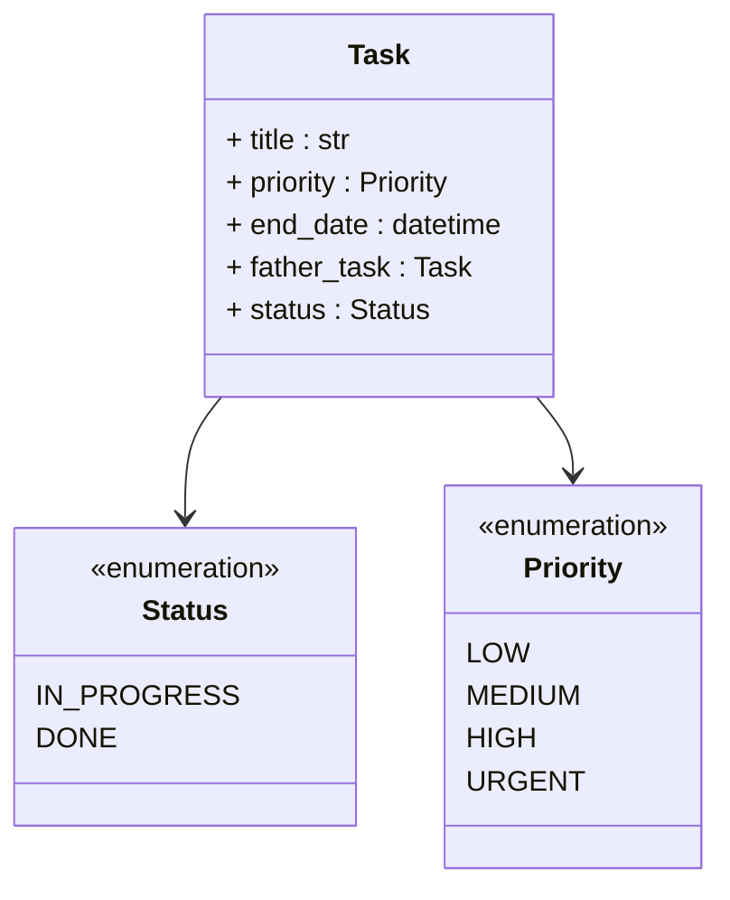

# UML Class Diagrams for Taskflow Models

```mermaid
classDiagram

class Task { 
    %% Atributes 
    + title : str 
    + priority : Priority
    + end_date : datetime 
    + father_task : Task 
    + status : Status

}

class Status {
    <<enumeration>>
    IN_PROGRESS
    DONE 
}

class Priority {
    <<enumeration>>
    LOW
    MEDIUM
    HIGH
    URGENT 
}

Task --> Status
Task --> Priority


``` 